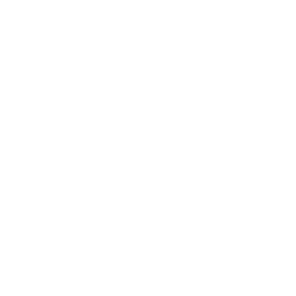

 <br>
# Timeless Threads
*A Dedicated web-based e-commerce platform for Timeless Threads to replace its reliance on Instagram for sales* <br>
The system will streamline product browsing, secure checkout, payment processing (via QR or Gcash), and automate inventory and Order management, Replacing Error-prone manual spreadsheets.

## 🛠 Tech Stack


---

## 📁 Project Structure
```
Timeless-Threads/
├── server/                       # Backend (Node.#s + Express + MySQL)
│   ├── app.js                    # Express server entry point
│   ├── app.prod.js               # Production server entry (used for PM2)
│   ├── config/                   # Database config
│   │   └── db.config.js
│   ├── controllers/              # Express route handler logic
│   ├── database/                 # SQL schema and seed files
│   ├── models/                   # Data access models (raw SQL)
│   ├── routes/                   # Express route definitions (API endpoints)
│   ├── uploads/                  # Uploaded files (e.g., user profile pictures)
│   └── utils/                    # Utility functions (e.g., email sending)
│
├── client/                       # Frontend (React + Vite + Tailwind CSS)
│   ├── index.html                # Main HTML entry point
│   ├── public/                   # Public static files
│   │   ├── images/               # Product, logo, and payment images
│   │   ├── videos/               # Tutorial or promo videos
│   │   └── documents/
│   └── src/
│       ├── components/           # Reusable React UI components
│       ├── api/                  # Axios API service functions
│       ├── css/                  # Custom CSS (main.css)
│       ├── App.jsx, main.jsx     # Main React app entry and bootstrap
│       └── (various .jsx files)  # Page and feature components (e.g., Login, Cart, Dashboard, etc.)
│
├── config/                       # Frontend build and styling config (Vite, Tailwind, PostCSS)
│   ├── postcss.config.js
│   ├── tailwind.config.js
│   └── vite.config.js
│
├── .env                          # Backend environment variables
├── .gitignore
├── package.json                  # Project dependencies and scripts (shared for client/server)
├── package-lock.json
├── README.md
├── LICENSE
```

---

## 📌 Notes
- Backend follows the MVC (Model-View-Controller) Architectural Pattern
- Frontend follows the Component-Based-Architecture Pattern
- Frontend makes API calls (via Axios) to the backend
---

## Prerequisites
- Node.js v18+
- MySQL 8.0+
---
## Setup  
Quick Setup Guide for the Application

1. Create a database named `timeless_db` in MySQL:

    ```bash
    CREATE SCHEMA `timeless_db` ;
    ```
    **OR**
    ```bash
    CREATE DATABASE timeless_db;
    ```

2. Clone the repository:

    ```bash
    git clone https://github.com/watsonjph/Timeless-Threads
    ```

3. Install dependencies:

    ```bash
    npm install
    ```

4. Build the project:

    ```bash
    npm run dev
    ```
    **OR**
    ```bash
    npm run dev:server
    npm run dev:client
    ```
    **OR**
    *For Production:*
    ```
    npm run build
    pm2 start server/app.prod.js --name "Timeless"
    ```
---
## Group Members:

[](https://github.com/watsonjph) [](https://github.com/PaoloBen) 
<a href="https://github.com/sojaARY">
    
</a>
